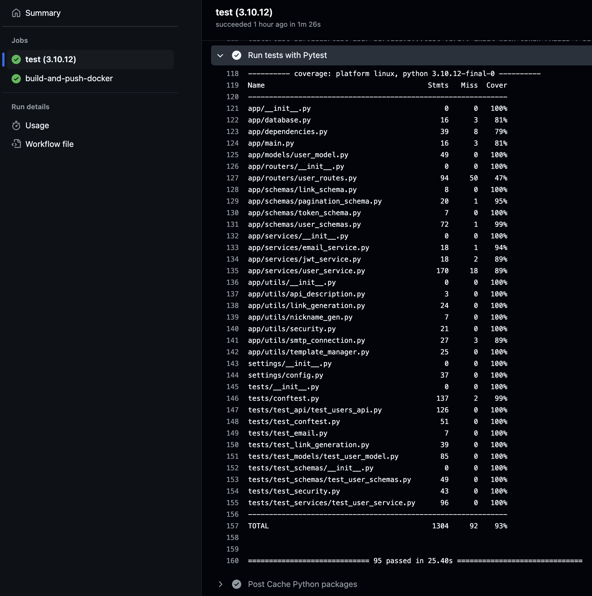
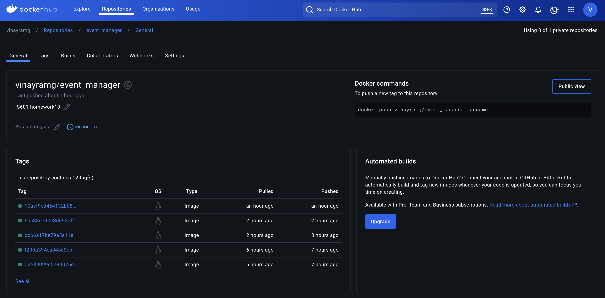

# IS601-Homework10

## Documentation of closed issues:

1\. Fixed errors in pytest by changing the schema names in the tests from `username` to `nickname` as defined in the [user_model.py](./app/models/user_model.py). Also fixed the missing token issue by defining `user_token`, `admin_token` and `manager_token` in [conftest.py](./tests/conftest.py).

[Issue#1](https://github.com/vinay-ram1999/event_manager/issues/1)

2\. Created a new account in [mailtrap.io](https://mailtrap.io/home) and added the credentials in [config.py](./settings/config.py) for testing the email delivery serice which concluded the pytest errors.

[Issue#1](https://github.com/vinay-ram1999/event_manager/issues/1)

3\. Fixed the random nickname generation bug. The previous [logic](./app/utils/nickname_gen.py) was handled in such a way that the nickname is randomly generated even after the user has declared a specific nickname which they want to use. This issue was fixed and tested using pytest.

[Issue#3](https://github.com/vinay-ram1999/event_manager/issues/3)

4\. Earlier for registering/creating a new user only email and password were required. Now, the user must provide a valid username along with email and password to register themselves. To acheive this changes are made in [user_schemas.py](./app/schemas/user_schemas.py).

[Issue#3](https://github.com/vinay-ram1999/event_manager/issues/3)

5\. In this issue, the email verification requirments are updated. Earlier, the users' `id` and `verification_token` are required for processing the email verification and the `id` must be collected from the database which is tedious. Now, to complete the email verification the users' `email` and `verification_token` which streamlines this step.

[Issue#5](https://github.com/vinay-ram1999/event_manager/issues/5)

6\. To test the CRUD operations under routes taged as "User Management Requires (Admin or Manager Roles)" the current user must have a `Manager` or `ADMIN` role. By default there is no admin user declared for us to login and test these routes. 

To fix this issue, a default admin user is automatically added to the postgres database with credentials defined in [config.py](/settings/config.py). Using this `admin_email` and `admin_password` (mentioned below) we can authorize the current session in the fastAPI and perform all CRUD tests with `ADMIN` privileges.

https://github.com/vinay-ram1999/event_manager/blob/10acf9cd454132b080dfcf3062f46404d33b8da2/settings/config.py#L16-L18

[Issue#7](https://github.com/vinay-ram1999/event_manager/issues/7)

7\. If a newly registered user tries to login without completing the email verification the logic returns an Unauthorized HTTP response code "401: Incorrect email or password." which isn't very user friendly since the email and password entered by the user might be correct. 

To fix this, a new warning is placed such that if an user without email verification tries to login, the API returns a BadRequest HTTP response code "400: Complete email verification to login." so that the user knows that they must complete email verification to login.

[Issue#9](https://github.com/vinay-ram1999/event_manager/issues/9)

8\. When registering/creating a new user the `nickname` entered must be checked to see if it is already taken by someone else or not. This is to make sure that the `nickanme` remains unique as it is required by the user model.

[Issue#11](https://github.com/vinay-ram1999/event_manager/issues/11)

9\. The password entered by the user should meet the following requirements:

* minimum length = 8
* should contain upper and lower case letters
* should at least contain 1 alpha numeric characters
* should contain numbers

This is achevied by validating the password using the pydantic validator by declaring a custom function displayed below.

https://github.com/vinay-ram1999/event_manager/blob/10acf9cd454132b080dfcf3062f46404d33b8da2/app/schemas/user_schemas.py#L23-L27

[Issue#13](https://github.com/vinay-ram1999/event_manager/issues/13)

## Pytest Coverage

## Docker Hub

[Link](https://hub.docker.com/repository/docker/vinayramg/event_manager/general)

## Learning from this assignment

This assignment was an invaluable learning experience, offering both technical growth and insights into collaborative development processes. By approaching the event manager application through a QA perspective, I systematically explored the user lifecycle, uncovering bugs and identifying areas for improvement. Each challenge pushed me to refine existing functions or create new ones, deepening my understanding of the codebase. Working with Docker Compose was particularly rewarding, as it allowed me to learn how microservices communicate internally and troubleshoot connectivity issues using tools like pgAdmin. Writing test cases and improving code coverage further enhanced my technical skills, helping me understand the importance of robust testing in software development.

One of the main challenges was balancing the need to fix immediate issues while maintaining a long-term view of the application’s design and functionality. By leveraging creative solutions and reusing existing functions efficiently, I gained confidence in navigating complex codebases and solving problems systematically. This process also highlighted the importance of clear communication and collaboration between QA and development teams, as these interactions are key to building reliable applications. Overall, this assignment reinforced the value of a structured, detail-oriented approach to both development and testing while leaving me with a greater appreciation for the synergy between technical and collaborative efforts.